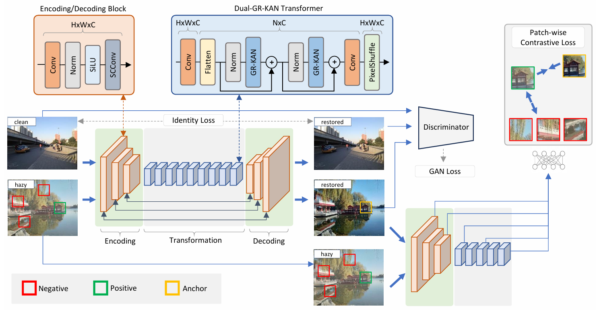
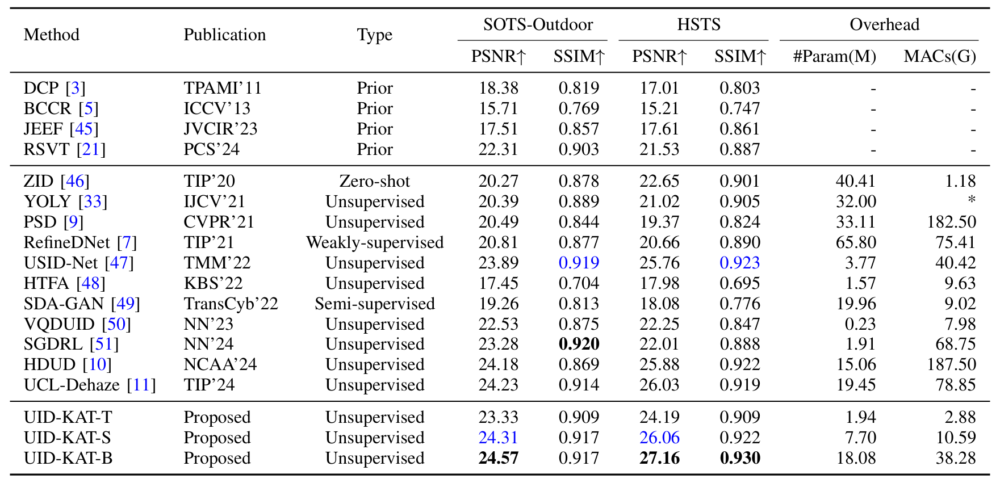
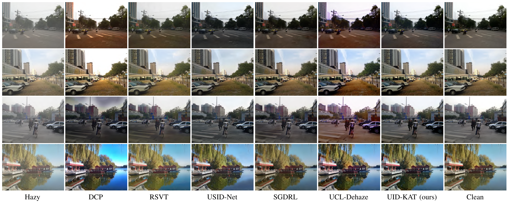
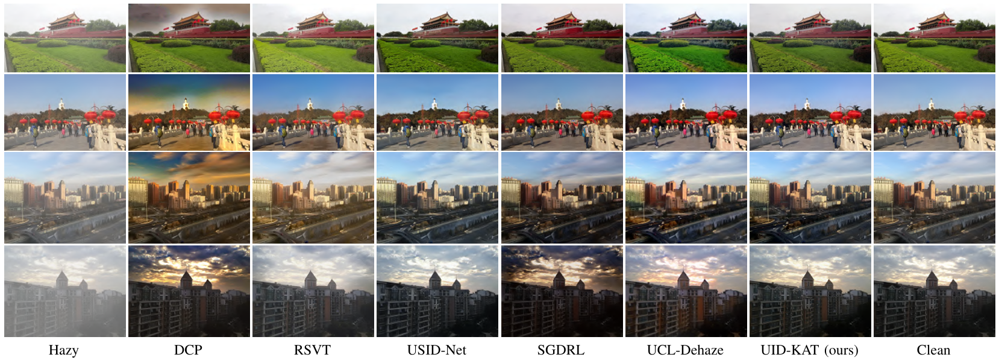
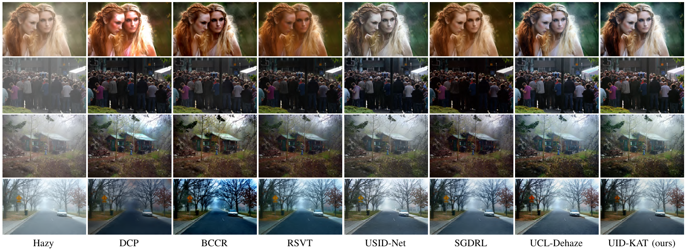

# UID-KAT: Unpaired Image Dehazing via Kolmogorov-Arnold Transformation of Latent Features

[](https://arxiv.org/abs/2502.07812)

This is the implementation of the paper [Unpaired Image Dehazing via Kolmogorov-Arnold Transformation of Latent Features](https://arxiv.org/abs/2502.07812).

Author: Le-Anh Tran

## Framework
<p align="center">

</p>

## Quantitative Results
<p align="center">

</p>

## Qualitative Results

<p align="center">

</p>

<p align="center">

</p>

<p align="center">

</p>

## Dependencies
It is recommended to run the project with the following main dependencies (or equivalent) for effective development:
- pytorch 2.1
- cuda 12.1
- cudnn 8.9.2
- [rational_kat_cu](https://github.com/Adamdad/rational_kat_cu)

## Train

Specify model configurations:


| Model type | --ngf | --n_kat_blocks |
| :---: | :---: | :---: |
| Tiny | 16 | 9 |
| Small | 32 | 9 |
| Base | 64 | 5 |

For example:
```
--batch_size 1
--n_epochs 50
--n_epochs_decay 50
--ngf 32
--n_kat_blocks 9
```

Run training script:

```bashrc
$ python train.py --dataroot ./datasets/train1 --name uidkat --batch_size 1 --n_epochs 50 --n_epochs_decay 50 --ngf 32 --n_kat_blocks 9
```

## Test

Download model checkpoints from [HuggingFace](https://huggingface.co/tranleanh/uid-kat) and locate them in [checkpoints/](https://github.com/tranleanh/uid-kat/tree/main/checkpoints).

Specify image paths and model configurations, then run:

```bashrc
$ python dehaze_image.py
```

## Citation
```bibtex
@article{tran2025unpaired,
  title={Unpaired Image Dehazing via Kolmogorov-Arnold Transformation of Latent Features},
  author={Tran, Le-Anh},
  journal={arXiv preprint arXiv:2502.07812},
  year={2025}
}
```

## Acknowledgments

This project is developed based on the following resources:
- [UCL-Dehaze](https://github.com/yz-wang/UCL-Dehaze)
- [Kolmogorov–Arnold Transformer](https://github.com/Adamdad/kat)
- [PoolFormer](https://github.com/sail-sg/poolformer)

Many thanks for their awesome works!

LA Tran
